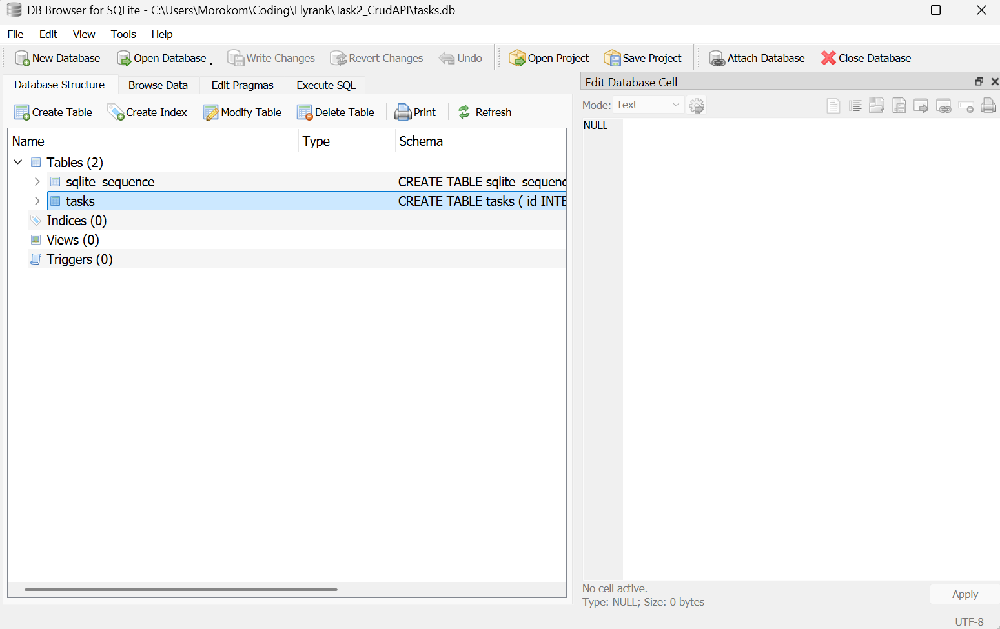

# Task API

A simple REST API for managing tasks, built with **FastAPI** and **SQLite**.

## Features

- `GET /tasks` — list all tasks
- `GET /tasks/{id}` — get a single task
- `POST /tasks` — create a task
- `PUT /tasks/{id}` — update a task
- `DELETE /tasks/{id}` — delete a task
- `GET /health` — health check

## Why SQLite?

SQLite was chosen because it's a **zero-configuration, file-based database** — there's
no separate server process to install, run, or configure. The entire database lives in
a single file, which makes the project trivially portable: anyone can clone the repo,
run one command, and have a fully working database with no external dependencies (no
Postgres/MySQL server, no Docker, no connection strings). This is a great fit for a
small project like this Task API, where simplicity and easy setup matter more than
concurrent write throughput or multi-user scaling.

## Where the database is stored

The database is stored in a single file, **`tasks.db`**, created in the project's root
directory (wherever the app is run from). It is created automatically the first time
the app starts — you do not need to create it manually.

On startup, `init_db()`:
1. Creates the `tasks` table if it doesn't already exist (`CREATE TABLE IF NOT EXISTS`)
2. Seeds it with 3 example tasks *only if the table is empty*, so re-running the app
   won't duplicate data

> `tasks.db` is a generated file and should be added to `.gitignore` rather than
> committed to the repo — each clone will generate its own copy automatically.

## How to run the project

**Requirements:** Python 3.9+

```bash
# 1. Clone the repository
git clone <your-repo-url>
cd <your-repo-folder>

# 2. Create and activate a virtual environment (recommended)
python -m venv venv
source venv/bin/activate      # Windows: venv\Scripts\activate

# 3. Install dependencies
pip install fastapi uvicorn

# 4. Run the app
python main.py
```

> ⚠️ Run the app with `python main.py`, **not** `uvicorn main:app --reload`.
> The database is initialized inside the `if __name__ == "__main__":` block, so it
> must be run directly to auto-create `tasks.db` on first launch.

Once running, the API is available at **http://127.0.0.1:8000**, and interactive docs
(Swagger UI) are available at **http://127.0.0.1:8000/docs**.

## Viewing the database

You can inspect `tasks.db` with [DB Browser for SQLite](https://sqlitebrowser.org/) or
the [SQLite Viewer VS Code extension](https://marketplace.visualstudio.com/).


*(Replace this image with a screenshot of your `tasks` table open in DB Browser or the
VS Code SQLite Viewer.)*

## Example query

Below is one of the queries the API runs internally — fetching a single task by ID
(used in `GET /tasks/{id}`):

```sql
INSERT INTO tasks (title, done) VALUES ("Get Some Sleep", 1);
```

You can run the same query manually in DB Browser's **Execute SQL** tab (substituting
`?` with an actual id) to inspect a specific task's data directly.